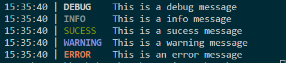

# Log4CPP

A simple logging libary for cpp.

## Example
You can find the example code in the example directory.
Make sure to read the </code> [Readme.md](example/Readme.md) </code>

## License
This Project is under the [MIT LICENSE](LICENSE)