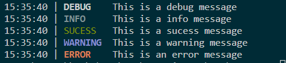

# The example

Here is an example on how to use Log4CPP.

First you need to inport the logger header
```
#define LOG4CPP_IMPL
#include <Log4CPP/logger.hpp>
```

> The <code>#define LOG4CPP_IMPL</code> line defines, that 
> you include with the code implementation. When you have 
> multiple files where you need the logger, create 1 .cpp 
> file and write there <code>#define LOG4CPP_IMPL</code> and
> <code> #include \<Log4CPP/logger.hpp></code> then in the 
> other files where you want to use it just include the 
> Log4CPP header file.

Then we create our main function
```
int main(int argc, char** argv) {
```

There we create an instance of the Logger class
```
logger Logger;
```

Then we use it to log messages
```
Logger.debug("This is a debug message");
Logger.info("This is a info message");
Logger.sucess("This is a sucess message");
Logger.warning("This is a warning message");
Logger.error("This is an error message");
```

After that, we just close the main function
```
return 0;
}
```

That gives use (in my terminal) following output:


Here is the complete resulting code

```
#define LOG4CPP_IMPL
#include <Log4CPP/logger.hpp>

int main(int argc, char** argv) {
    logger Logger;

    Logger.debug("This is a debug message");
    Logger.info("This is a info message");
    Logger.sucess("This is a sucess message");
    Logger.warning("This is a warning message");
    Logger.error("This is an error message");

    return 0;
}
```